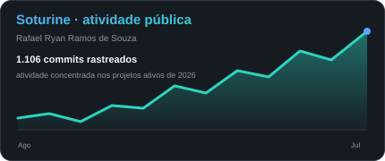
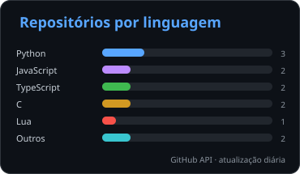
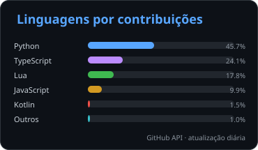

# Rafael Ryan Ramos de Souza 🦊

### Técnico em Mecatrônica | Graduando em Engenharia da Computação | Software, IA Aplicada e Sistemas Confiáveis

**Python • TypeScript • React • FastAPI • Node.js • Android • IoT • Sistemas Embarcados • DevTools**

---

## 👨‍💻 Perfil

Sou **Técnico em Mecatrônica** e graduando em **Engenharia da Computação na Universidade do Vale do Paraíba (UNIVAP)**. Desenvolvo projetos que conectam software, inteligência artificial, interfaces modernas, automação, IoT, robótica e sistemas embarcados.

Meu foco atual está em **produtos full stack**, ferramentas local-first, engenharia de contexto para agentes de IA, automação responsável, segurança, auditabilidade e sistemas de apoio à decisão. Procuro transformar ideias em produtos demonstráveis, com documentação, testes, limites explícitos e evidências técnicas.

---

## 🏭 Experiência profissional

### Embraer

- **Estágio técnico em Ensaios Estruturais e Instrumentação — 2022 a 2023**
- **Atuação profissional na produção — 2023 a 2025**
- Experiência em ambiente industrial, disciplina operacional, processos, qualidade, segurança e trabalho em equipe

---

## 🚀 Projetos principais

### 💼 SotuHire — Plataforma local-first para carreira, vagas, editais e candidaturas

Produto full stack, multiárea e baseado em evidências para organizar trajetória profissional, analisar currículos e vagas, melhorar aderência ATS, preparar candidaturas, interpretar editais e acompanhar oportunidades sem transformar decisões importantes em automação cega.

- **Application Lab** persistente para readiness, estratégia, variantes, kits e snapshots de candidatura
- **Resume Studio** com Currículo Mestre, editor, autosave, diff, templates ATS-safe, preview e JSON Resume
- Perfil Profissional Universal, Match, ATS, Tailor, Radar, Wishlist, Tracker/Kanban e notificações
- Lattes/acadêmico, Editais/Concursos, GitHub/Portfólio e fontes públicas revisáveis
- Backend local em **Python/FastAPI** e frontend em **React, Vite e TypeScript**
- RAG/memória local, Career Context Engine e IA opcional com Gemini/OpenAI e fallback local
- Extensão assistiva com captura revisável, fila offline e integração pela Local Companion API
- Governança de prompts, structured output, benchmarks, golden datasets, feedback humano e rastreabilidade de execuções de IA
- Sem auto-apply, inscrição automática, pagamento, bypass de CAPTCHA ou promoção de evidência não confirmada a fato

🔗 [Repositório](https://github.com/Soturine/SotuHire) • [Documentação](https://soturine.github.io/SotuHire/)

---

### 🩺 Prescripta — Segurança de medicamentos e decisão auditável

Aplicação demonstrativa e educacional para tornar explícitos dados clínicos fictícios, regras determinísticas, cobertura, dados ausentes, fontes, revisão humana, relatórios e auditoria em uma arquitetura **FastAPI + React**.

- Envelope canônico de decisão com cobertura, achados, fontes, dados faltantes e abstention
- Dose dimensional para massa, frequência, taxa, infusão, procedimento e exposição acumulada
- Catálogo demonstrativo por princípio ativo, produto, aliases, jurisdição, versão e status de revisão
- Autorização por instituição, papel e escopo de paciente, com auditoria de acessos negados
- Snapshots imutáveis, hash de JSON canônico e relatórios históricos reproduzíveis
- Reconciliação de importações com consentimento e decisão humana por item
- Override governado com justificativa e segundo revisor independente
- Cookie HttpOnly, lockout persistente, MFA TOTP opcional e startup seguro fora do modo local
- IA explicativa opcional, credenciais criptografadas, proteção SSRF, circuit breaker e fallback determinístico
- Alembic, PostgreSQL em CI, testes automatizados, SAST/SCA, secret scan e SBOM

> Projeto de portfólio e pesquisa. **Não é dispositivo médico, não possui validação clínica/regulatória e não deve ser usado em atendimento real.**

🔗 [Repositório](https://github.com/Soturine/Prescripta)

---

### 🚆 SotuRail — Context OS local-first para agentes de programação

CLI open source para preparar conhecimento compacto, evidências, workflows, relatórios e exports seguros para agentes de programação, mantendo os artefatos locais e sem se tornar um agente autônomo ou gateway obrigatório.

- Context e Project Brain para leitura progressiva, memória, claims verificáveis e briefs
- Knowledge e Evidence Rails com proveniência, verificação e estados honestos
- Evaluation, golden checks, Skills 2.0 e datasets determinísticos
- Workflow/Harness, tasklets, handoffs e coordenação segura de tarefas
- Relatórios, dashboard estático, observabilidade e exports redigidos para agentes
- Contratos de schema, readiness gates, baselines e evidência de release
- Suporte a hosts compatíveis com Codex, Claude, Cursor, Gemini e consumidores genéricos
- **TypeScript/Node.js** como base portátil e aceleração nativa opcional em **Rust**
- Sem telemetria obrigatória, chamadas externas de LLM, embeddings pagos ou reescrita autônoma de código

🔗 [Repositório](https://github.com/Soturine/soturail) • [npm](https://www.npmjs.com/package/soturail)

---

### 🏎️ Soturine's Chaos Randomizer — Mod experimental para BeamNG.drive

UI App experimental que monta veículos inesperados usando o conteúdo carregado no BeamNG.drive, com randomização limitada e rastreável de configurações, peças, tuning e pintura.

- Modos **Random Car**, **Scramble** e **Full Random** em operações transacionais
- Seeds reproduzíveis, locks, histórico, cancelamento, recovery e classificações honestas de resultado
- **Vehicle DNA**, garagem local, comparação, restore, replay, mutações e exportação/importação validada
- Geração de competidores, posicionamento, grids, corrida e modos de IA suportados
- Descoberta dinâmica de veículos, configurações, slots, peças, rodas, tuning e energia
- Proteções para peças críticas, combustível, fluidos, callbacks atrasados e estados parciais
- Empacotamento versionado com checksum, manifesto e evidências automatizadas
- Compatibilidade principal voltada ao BeamNG 0.39, com validação presencial no jogo registrada separadamente

🔗 [Repositório](https://github.com/Soturine/beamng-soturine-chaos-randomizer) • [Releases](https://github.com/Soturine/beamng-soturine-chaos-randomizer/releases)

---

## ⚙️ Engenharia aplicada

### 🧓 Sistema IoT de Detecção de Quedas

Projeto acadêmico full stack que integra **ESP32 + MPU6050**, MQTT, backend Node.js, MySQL, Socket.IO e frontend React para monitorar quedas, imobilidade e telemetria.

- Detecção local conservadora com impacto, orientação e imobilidade
- Pareamento de dispositivos, organizações, pacientes, papéis e histórico de vínculos
- Eventos MQTT idempotentes, deduplicação, fila local, correlação e evidência estruturada
- Dashboard multi-tenant, telemetria em tempo real, alertas e diagnóstico operacional
- Modos Normal e Demo, calibração, testes, stress dry-run e registros reais do sistema em bancada

🔗 [Repositório](https://github.com/Soturine/iot-fall-monitor)

---

### 📱 Scanora — Scanner Android local-first

Aplicativo Android para digitalização de documentos com processamento local, OCR no dispositivo e fluxo unificado entre captura, revisão e exportação.

- Kotlin, Jetpack Compose, Material 3, Coroutines e Flow
- ML Kit Document Scanner, Text Recognition e CameraX
- Pipeline único para crop, filtros, preview, OCR e arquivo final
- Exportação em PDF, JPG e PNG, compartilhamento e histórico local
- Room, DataStore, WorkManager e arquitetura modular por features
- Sem backend obrigatório, login ou sincronização no MVP

🔗 [Repositório](https://github.com/Soturine/scanora) • [Site](https://soturine.github.io/scanora/)

---

## 🎓 Projetos acadêmicos selecionados

| Projeto | O que demonstra | Tecnologias |
| --- | --- | --- |
| [**Biblioteca Geek Fullstack**](https://github.com/Soturine/biblioteca-geek-fullstack) | Autenticação, autorização, CRUD, reservas, logs, relatórios e arquitetura em camadas | Node.js, Express, MySQL, MongoDB, JWT, Bootstrap |
| [**Vale dos Casos**](https://github.com/Soturine/fazenda-inteligente-cbr) | Jogo web 2D com assistente agrícola baseado em Raciocínio Baseado em Casos | TypeScript, Vite, Phaser 3, CBR |
| [**PetBot**](https://github.com/Soturine/petbot-prolog-ia) | Sistema especialista explicável com regras, score, alertas, vetos e testes | SWI-Prolog |
| [**Robô Sumô ESP32**](https://github.com/Soturine/esp32-sumo-robot) | Robótica móvel, sensores, PWM, borda, busca e ataque | C, ESP-IDF, PlatformIO, ESP32 |
| [**Robô Seguidor de Linha**](https://github.com/Soturine/esp32-line-follower-robot) | Controle discreto, filtros de leitura e presets de resposta | C, ESP-IDF, PlatformIO, ESP32 |

---

## 🛠️ Stack e competências

### Stack principal

`Python` `TypeScript` `JavaScript` `React` `FastAPI` `Node.js` `REST APIs` `SQL`

### Mobile

`Kotlin` `Jetpack Compose` `Material 3` `CameraX` `ML Kit` `Room` `DataStore` `WorkManager`

### IoT, sistemas embarcados e robótica

`C` `C++` `ESP32` `ESP-IDF` `PlatformIO` `FreeRTOS` `MQTT` `MPU6050` `HC-SR04` `TCRT5000` `L298N`

### Dados, qualidade e entrega

`PostgreSQL` `MySQL` `MongoDB` `SQLite` `Pydantic` `pytest` `Ruff` `Vitest` `Playwright` `GitHub Actions` `SAST/SCA` `SBOM` `npm`

### Experiência complementar

`Java` `C#` `PHP` `Prolog` `Phaser 3` `Rust` `PowerShell` `Figma`

---

## ✅ Princípios de desenvolvimento

- **Local-first e privacidade**, reduzindo dependências externas desnecessárias
- **IA como apoio**, com structured output, revisão humana, fallback e rastreabilidade
- **Evidências antes de claims**, diferenciando o que foi testado, inferido ou ainda está pendente
- **Segurança proporcional ao domínio**, especialmente em saúde, dados pessoais e automações
- **Arquitetura clara e testes úteis**, sem transformar MVP em overengineering
- **Documentação atual**, com limites, riscos conhecidos e próximos passos explícitos
- **Automação responsável**, sem spam, auto-apply, bypass ou ações críticas sem confirmação

---

## 🎵 Projeto musical — Soturine

Além da programação, produzo músicas e experimentos criativos usando o nome **Soturine**.

  
  

---

## 📊 Estatísticas

  

  
  

  Cards hospedados no próprio repositório e atualizados automaticamente pelo GitHub Actions.

---

## 🎮 Contribuições

  <picture>
    <source media="(prefers-color-scheme: dark)" srcset="https://raw.githubusercontent.com/Soturine/Soturine/output/pacman-contribution-graph-dark.svg">
    <source media="(prefers-color-scheme: light)" srcset="https://raw.githubusercontent.com/Soturine/Soturine/output/pacman-contribution-graph.svg">
    
  </picture>

---

  <em>Construindo produtos que conectam software, hardware, evidências, criatividade e problemas reais.</em>

